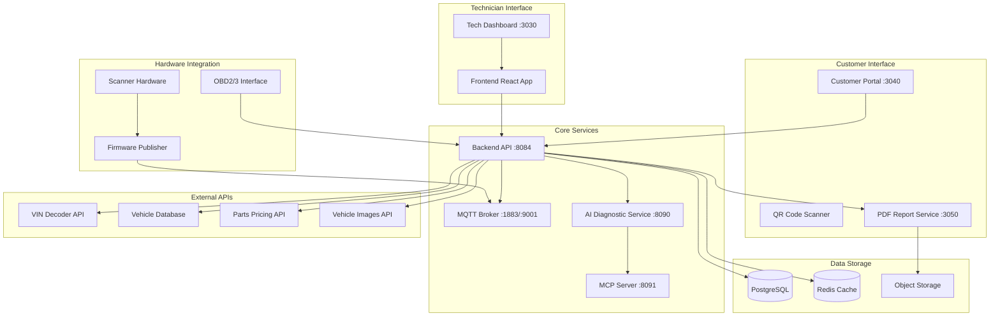

# MOTOSPECT System Architecture

## Overview

MOTOSPECT is a comprehensive vehicle diagnostic system that combines hardware sensors with intelligent software analysis to provide detailed vehicle health reports.

## Version 2.0 Updates

### Key Improvements
- **Environment Configuration**: All configuration moved to `.env` file
- **NHTSA Integration**: Full VIN decoder API with fallback mode
- **CORS Support**: Complete cross-origin resource sharing
- **Testing Suite**: Playwright GUI tests, integration tests, E2E scenarios
- **Ansible Automation**: Deployment and testing playbooks
- **Enhanced Logging**: Debug mode with comprehensive logging

## Architecture Diagram



## Container Architecture

### Optimization Highlights

#### Backend Service
- **Base Image**: Python 3.9-slim
- **Package Manager**: UV (Ultra-Velocity) for faster dependency installation
- **Multi-stage Build**: Reduces final image size
- **Layer Caching**: Optimized for faster rebuilds
- **Health Checks**: Built-in container health monitoring

#### Frontend Service
- **Base Image**: Node.js 18 Alpine
- **Production Build**: Optimized static assets
- **Multi-stage Build**: Smaller final image size
- **Efficient Serving**: Using `serve` for static files

#### Performance Features
- **BuildKit**: Parallel builds and better caching
- **Resource Limits**: CPU/Memory constraints for stability
- **Volume Optimization**: Named volumes for dependency caching
- **Minimal Context**: Optimized `.dockerignore` files

## Component Architecture

### 1. Frontend Services

#### Customer Portal (:3040)
- **Purpose**: Customer-facing interface for vehicle scanning
- **Features**:
  - VIN entry/scanning
  - Scanning progress visualization
  - QR code generation for report access
  - Real-time scanning animation

#### Technician Dashboard (:3030)
- **Purpose**: Service technician interface
- **Features**:
  - Live data visualization
  - Diagnostic results
  - Service history
  - Component pricing

#### PDF Report Service (:3050)
- **Purpose**: Report generation and download
- **Features**:
  - Dynamic PDF generation
  - Component diagrams
  - Cost estimates
  - Service recommendations

### 2. Backend Services

#### Core API (:8084)
```
┌─────────────────────────────────────┐
│         FastAPI Backend              │
├─────────────────────────────────────┤
│  • Vehicle Management                │
│  • OBD Interface                     │
│  • Scanning Orchestration            │
│  • Report Generation                 │
│  • WebSocket & MQTT Bridge           │
└─────────────────────────────────────┘
```

#### AI Diagnostic Service (:8090)
- **Model**: 3B parameter LLM for fault analysis
- **Functions**:
  - Anomaly detection
  - Fault prediction
  - Service recommendations
  - Cost optimization

### 3. Data Flow Architecture

```
┌──────────┐    ┌──────────┐    ┌──────────┐
│   OBD    │───>│  Backend │───>│    AI    │
│  Data    │    │   API    │    │  Service │
└──────────┘    └──────────┘    └──────────┘
      │              │                │
      v              v                v
┌──────────┐    ┌──────────┐    ┌──────────┐
│   MQTT   │    │ Database │    │  Reports │
│  Broker  │    │   Store  │    │   (PDF)  │
└──────────┘    └──────────┘    └──────────┘
```

## OBD Integration Architecture

### OBD2/OBD3 Protocol Stack
```
Application Layer
    │
    ├── Diagnostic Services (UDS)
    ├── Parameter IDs (PIDs)
    └── Trouble Codes (DTCs)
    │
Transport Layer
    │
    ├── ISO-TP (ISO 15765-2)
    └── CAN Transport Protocol
    │
Network Layer
    │
    ├── CAN Bus (ISO 11898)
    ├── K-Line (ISO 9141-2)
    └── J1850 PWM/VPW
    │
Physical Layer
    │
    └── OBD Connector (J1962)
```

## Database Schema

```sql
-- Core Tables
vehicles
├── id (UUID)
├── vin (VARCHAR)
├── make, model, year
├── engine_size (DECIMAL)
└── metadata (JSONB)

scans
├── id (UUID)
├── vehicle_id (FK)
├── scan_type (ENUM)
├── timestamp
└── data (JSONB)

diagnostics
├── id (UUID)
├── scan_id (FK)
├── fault_codes (ARRAY)
├── ai_analysis (TEXT)
└── recommendations (JSONB)

reports
├── id (UUID)
├── diagnostic_id (FK)
├── pdf_url (VARCHAR)
├── qr_code (VARCHAR)
└── created_at
```

## API Integrations

### 1. VIN Decoder Services
- **NHTSA API**: Free US government API for VIN decoding
- **CarMD API**: Commercial API with diagnostic data
- **AutoData API**: Comprehensive vehicle specifications

### 2. Parts & Pricing
- **RockAuto API**: Parts catalog and pricing
- **PartsGeek API**: Alternative parts sourcing
- **Labor Time Guide API**: Service time estimates

### 3. Vehicle Images
- **Edmunds Media API**: Stock vehicle images
- **CarFax Image API**: Vehicle photography
- **Custom S3 bucket**: User-uploaded images

## Security Architecture

```
┌────────────────────────────────────┐
│         API Gateway                 │
│    • Rate Limiting                  │
│    • Authentication (JWT)           │
│    • CORS Policy                    │
└────────────────────────────────────┘
                │
┌────────────────────────────────────┐
│       Security Middleware           │
│    • Input Validation               │
│    • SQL Injection Prevention       │
│    • XSS Protection                 │
└────────────────────────────────────┘
                │
┌────────────────────────────────────┐
│         Data Encryption             │
│    • TLS 1.3 (Transport)           │
│    • AES-256 (At Rest)             │
│    • Key Management (Vault)         │
└────────────────────────────────────┘
```

## Deployment Architecture

```yaml
# Docker Services Topology
services:
  mosquitto:     # MQTT Broker
    ports: [1883, 9001]
  
  backend:       # Core API
    ports: [8084]
    depends_on: [mosquitto, postgres, redis]
  
  frontend:      # Tech Dashboard
    ports: [3030]
    depends_on: [backend]
  
  customer:      # Customer Portal
    ports: [3040]
    depends_on: [backend]
  
  reports:       # PDF Service
    ports: [3050]
    depends_on: [backend]
  
  ai:           # AI Diagnostic
    ports: [8090]
    depends_on: [backend]
  
  postgres:     # Database
    ports: [5432]
  
  redis:        # Cache
    ports: [6379]
```

## Scaling Strategy

### Horizontal Scaling
- Load balancer for API services
- Read replicas for database
- Distributed MQTT broker cluster
- CDN for static assets

### Vertical Scaling
- GPU instances for AI service
- High-memory instances for data processing
- SSD storage for database

## Monitoring & Observability

```
Metrics Collection
    │
    ├── Prometheus (Metrics)
    ├── Grafana (Visualization)
    ├── ELK Stack (Logs)
    └── Jaeger (Tracing)
```

## Development Roadmap

### Phase 1: Core Infrastructure ✓
- [x] MQTT broker setup
- [x] Basic frontend/backend
- [x] WebSocket communication

### Phase 2: OBD Integration
- [ ] OBD2 protocol implementation
- [ ] Vehicle identification
- [ ] Parameter reading

### Phase 3: Customer Experience
- [ ] Customer portal UI
- [ ] Scanning simulation
- [ ] QR code generation

### Phase 4: AI & Reporting
- [ ] AI diagnostic service
- [ ] PDF report generation
- [ ] Cost estimation

### Phase 5: Production Ready
- [ ] Security hardening
- [ ] Performance optimization
- [ ] Deployment automation
